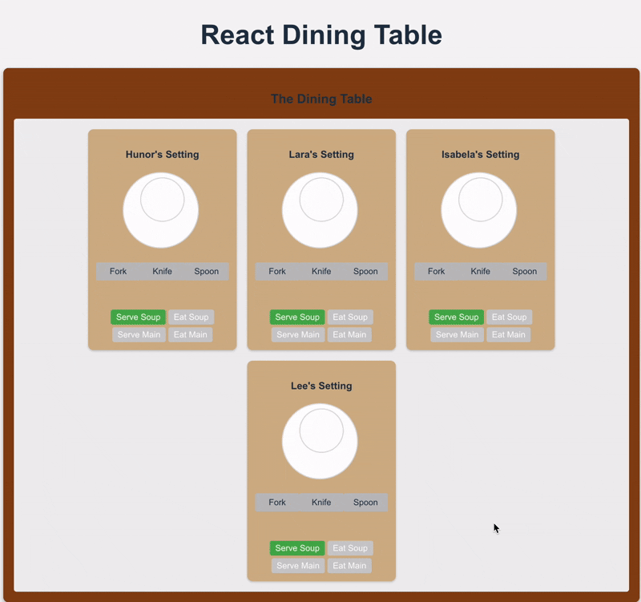

# React Dining Table App

A simple React application built with Vite that demonstrates fundamental React concepts including component hierarchy, state management, and React hooks (useState, useEffect).



## Features

- Visual representation of a dining table with tablecloth, placemats, plates, and utensils
- Interactive dining experience with serving and eating functionality
- Demonstrates proper React component structure
- Uses React hooks for state management
- Includes animations for plate transitions

## Getting Started

These instructions will help you set up and run the project on your local machine for development and testing purposes.

### Prerequisites

- Node.js (v14.0.0 or later)
- npm (v6.0.0 or later)

### Installation

1. Clone the repository:
```bash
git clone https://github.com/yourusername/dining-table-app.git
cd dining-table-app
```

2. Install dependencies:
```bash
npm install
```

3. Start the development server:
```bash
npm run dev
```

4. Open your browser and navigate to:
```
http://localhost:5173
```

## Project Structure

```
dining-table-app/
├── public/
├── src/
│   ├── components/
│   │   ├── Cloth.jsx
│   │   ├── Cloth.css
│   │   ├── MainPlate.jsx
│   │   ├── MainPlate.css
│   │   ├── Placemat.jsx
│   │   ├── Placemat.css
│   │   ├── SoupPlate.jsx
│   │   ├── SoupPlate.css
│   │   ├── Table.jsx
│   │   ├── Table.css
│   │   ├── Utensils.jsx
│   │   └── Utensils.css
│   ├── App.jsx
│   ├── App.css
│   ├── main.jsx
│   └── index.css
├── vite.config.js
├── package.json
└── README.md
```

## How to Use

1. The table starts with empty plates for each guest
2. Click "Serve Soup" to serve soup to a guest
3. Click "Eat Soup" to eat the soup (the soup plate will change color and then fade away)
4. Click "Serve Main" to serve the main course (only available after eating soup)
5. Click "Eat Main" to eat the main course (the main plate will change color and then fade away)

## React Concepts Demonstrated

- **Component Hierarchy**: Table > Cloth > Placemat > (MainPlate, SoupPlate, Utensils)
- **useState Hook**: Managing the state of plates and food
- **useEffect Hook**: Managing side effects like messages and timing
- **Conditional Rendering**: Showing different plate states based on serving/eating status
- **Event Handling**: Button clicks to trigger state changes

## Technologies Used

- React 18
- Vite
- CSS Modules

## License

This project is licensed under the MIT License - see the LICENSE file for details.